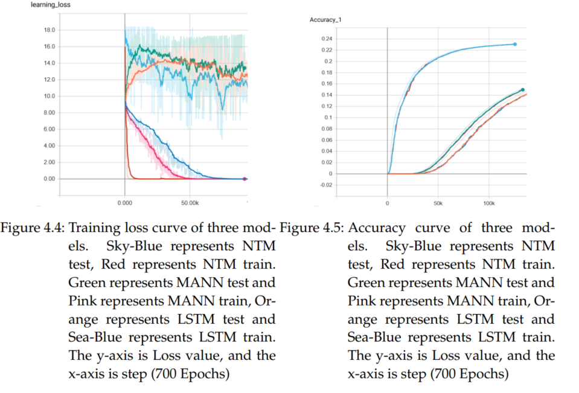

# Meta-learning for next song recommendation.

## Introduction

In this topic, [Meta-learning](https://github.com/Gaopeng-Bai/Meta-Learning-Papers) with [Memory-Augmented Neural Network](https://arxiv.org/pdf/1605.06065.pdf) has been used to recommend the next song to a user who tends to listen. From the user's existing playlist, the algorithm is used to predict the next song recommended to the user. And by allowing the user to provide feedback action on the current song, it is used to adjust the playlist to recommend the next new song. User feedback can determine whether a song that the user is currently listening to is added to the next predicted list, then the algorithm predicts the next song that the user may prefer to listen to based on this predicted list.

Model:

## Reqirements

 1. Please install the package specified in requirements before run this programm

 2. This model require [spotify datasets](https://research.spotify.com/datasets).

## Problem Description

The sequence of songs be assumed as a special language, that means a sequence of songs list represents individual meaning like a sentence or paragraph also carries specific meaning. Then my goal becomes a task that is comparable to natural language processing. For the natural language processing, a neural network model is needed to identify the meaning of the context. Moreover, due to the diversity of song sequences. The models must also be able to predict sequences that have never been seen and also ensure high output accuracy.

Due to the uncertainty and high variability of the song list order, the recommendation of new songs also depends on the similarity between the lists. This means that the use of recommended songs in the list is entirely dependent on past experience, unlike natural language processing that you can predict the entire sentence or paragraph by learning the rules that the sentence produces. The predictions in song recommendation are based on the eigenvalues in the learning experience. Due to the variability of the sequence of songs, it is difficult to have common features between sequences of songs. This makes the model strongly dependent on historical experience in the prediction stage, and also requires a large amount of historical experience data. Wherefore song recommendation requires meta-learning model to have high storage capacity and the ability to store as many song list features as possible to achieve the ultimate high-performance predictions.

## Approach

Memory-Augmented Neural network (MANN) is a meta learning method that was used to classify images. The algorithm establishes the framework of meta-learning so that the model can obtain high prediction accuracy on a small sample set, and can also maintain high accuracy for the new sample set. In the song sequence recommendation task, most of the recommended input data is a relatively new sample sequence. This reason is also an important reason why I use this algorithm to recommend songs. Based on the results of the above experiments, MANN can also maintain high prediction accuracy on a list that has never been seen.

To verify that the results of this study are objective, I use the [spotify python API](href{https://spotipy.readthedocs.io/en/latest/) to build an application (graphical user interface) that contains [MANN](https://arxiv.org/pdf/1605.06065.pdf) algorithms to recommend next song to user. 

This application reads the user's own playlists, and when the user clicks on the specific playlist, it will show all song information in the playlist table on application. Click the play button to remotely control the existing Spotify official terminal (official android application or official desktop application), click on the upper right corner to seek the current online terminal and connect the terminal. After the playlist is shown on the playlist table, user can click the refresh button to get the items of the recommended song. The all songs displayed in the application can be played by double-clicking. The buttons at the bottom of thumb-down and thumb-up are used to collect real-time feedback from the user. My application also has the necessary functions of the player. My application is a client that connects to the official music database of Spotify and can directly extract the current user's playlist information from database. After the user playlist data is prepossessed, the data is input into the trained model for recommended calculation. Use the model's output to query song details from the database. The client provides a user feedback function, which can adjust the input playlist according to the feedback, and then recommend new songs to the user. At this point, if the user submits positive feedback, the current song will be added as a new input to the original input sequence of the recommendation system. If negative feedback is submitted, this song will no longer appear in recommendations currently in the playlist as input. If no feedback is provided, the recommended input element will be the same as the playlist owned by the user.

## Usage for model

1. Run dataloader.py to generate training set and test set. set parameter in initialize class.

4. Set parameter in Train.py and run it to train the model.

## Results

* This study compared the results of the MANN, NTM, and LSTM models, respectively, using
the same model parameters, such as learning rate, batch size, and epochs. The training results of the three models are given below:

* Curve of results

It can be seen that the results of the three models on the test set
are not ideal. Because the data in the test set is too sparse and the training set has too little data. The songs in the playlist taken from the test set are valid data only if they also exist in the training set. And the training data set has only 2,000 playlists including nearly 14k songs.This makes it difficult to make accurate predictions on the test set. It can be seen from the figure that the test loss value of NTM is significantly lower than that of LSTM and MANN, and the test loss value of LSTM is also lower than that of MANN. This shows that NTM fits the new data better than the other two models, and LSTM is also better than MANN. It can also be seen from the figure that in the training speed, NTM is faster than the other two
models, and MANN’s training speed is still in the middle slightly faster than LSTM.

## Summary

First, the results of the three models in the test set are because the sequences in the test set are too sparse and the training set data is too small. Then on the
algorithm, from results it can be known that MANN’s pure content addressing mode makes
the algorithm itself does not support so well on the data of the sequence information. This
is mainly because the training task data is sequence information, and the required feature
is the relationship between the context of the sequence information, not the specific content
in the sequence. From the results of training, the least recently used access (LRUA) of pure
content addressing mechanism based on MANN is not sensitive to the context relationship of
processing sequence information. However, the NTM algorithm with a content-location addressing mechanism has a better effect on the training sequence information. MANN writes
new data to the least used address location and deletes useless information in time, so that
the overall effective information can be stored in memory, and the model can learn faster and
improve prediction accuracy. The NTM algorithm uses a content-location addressing mechanism to support content-insensitive data, such as variable data and sequence
information (the training results of this article can be known). However, because the algorithm stores data directly at the addressed location, even if there is data in memory that is
similar to the current data. The data in the memory of this algorithm is too complicated to
make it difficult to train the model and to reduce errors. Why don’t we combine the functions of the two algorithms? This not only ensures training speed and data that can support
sequence information.

## Further work

* new model proposed

* [Bloom-embeddings](https://github.com/maciejkula/spotlight/tree/master/examples/bloom_embeddings) to solve the diverse variable output dimension.

## Reference

[1]  SANTORO, Adam, et al. Meta-learning with memory-augmented neural networks. In: International conference on machine learning. 2016. S. 1842-1850.

[2] GRAVES, Alex; WAYNE, Greg; DANIHELKA, Ivo. Neural turing machines. arXiv preprint arXiv:1410.5401, 2014.

[3] SERRÀ, Joan; KARATZOGLOU, Alexandros. Getting deep recommenders fit: Bloom embeddings for sparse binary input/output networks. In: Proceedings of the Eleventh ACM Conference on Recommender Systems. 2017. S. 279-287.
